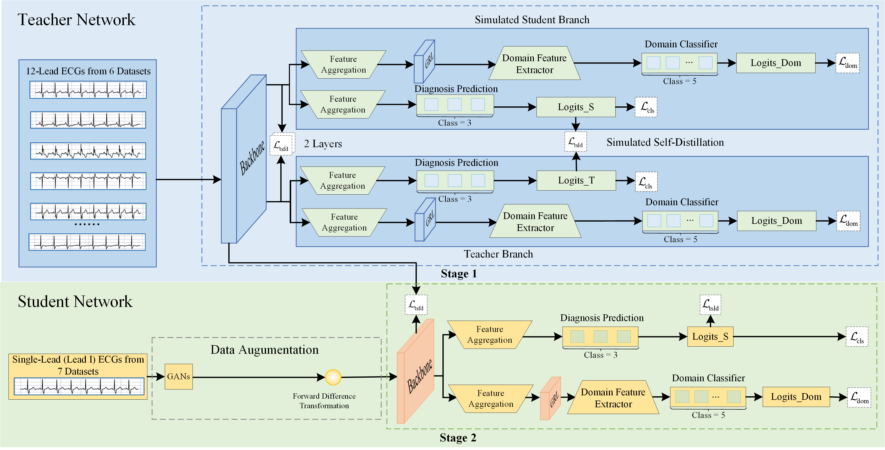

# 
✨X-LeadGen✨

>  The paper **"From Twelve Leads to Single: Cross-Lead Knowledge Distillation for Domain-Generalized Atrial Fibrillation Detection"** is currently under review. .
>

A two-stage cross-lead distillation framework for single-lead ECG AF detection that explicitly targets domain generalization.

  

## Environment Setup

To set up the environment for this project, you can use the [packages_ECGDG.txt](packages_ECGDG.txt) file located in the repository. This file contains a list of Python packages and their specific versions required for the project. You can also check the [requirements_ECGDG.txt](requirements_ECGDG.txt) file located in the repository. This file contains a list of Python packages and their specific versions required for the project, ensuring that all dependencies are installed correctly.

## Model Training Method

The training and testing of our model is divided into several stages. Each stage is implemented in separate Jupyter notebooks. Below are the details of each stage and the relevant files:

1. **Stage 1 - Teacher Network Training**  
   The first stage involves training of the **Teacher Network**. The relevant code for this is provided in the file: [Stage 1 Teacher Train.ipynb](Stage%201%20Teacher%20Train.ipynb).

2. **Stage 2 - Student Network Training and Testing**  
   The second stage focuses on training and testing the **Student Network**. This is implemented in the file: [Stage 2 Student Train.ipynb](Stage%202%20Student%20Train.ipynb).

3. **Data Augmentation Using GANs**  
   A key component of the Student Network is the **Data Augmentation** process, which is powered by Generative Adversarial Networks (GANs). The training code for GANs is located in the file: [GANs Train.ipynb](GANs%20Train.ipynb).

4. **Fine-tuning with Small Samples**  
   In our experiment, we perform **small-sample fine-tuning** to enhance the performance of the Student Network. The relevant code for this fine-tuning experiment can be found in the file: [finetune of Stage 2.ipynb](finetune%20of%20Stage%202.ipynb).

Please make sure to run the files in the sequence mentioned above for proper training and testing of the model.
